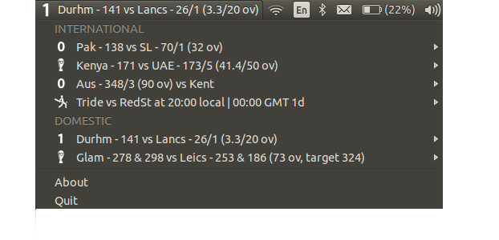
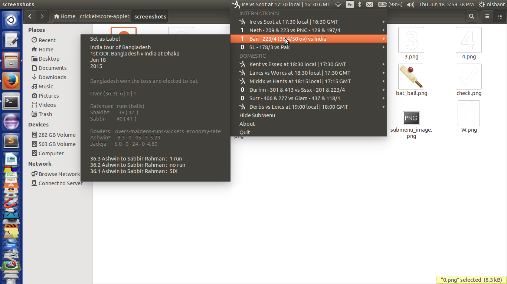

# ESPN Indicator
Displays live scores from ESPN website in your indicator panel

## Motivation
After being fed up with opening the ESPN Cricinfo website for checking the scores while working I along with my friend wrote the script for this appindicator.

## Working
Uses the unofficial JSON from [ESPN Website](http://www.espncricinfo.com/) to get the summary and scorecard for currently active matches.

## Screenshots
Shows the live scores in panel

Menu displays the current matches from the ESPN Cricinfo website.

Submenu shows scorecard (only for international matches such as IND vs AUS)

