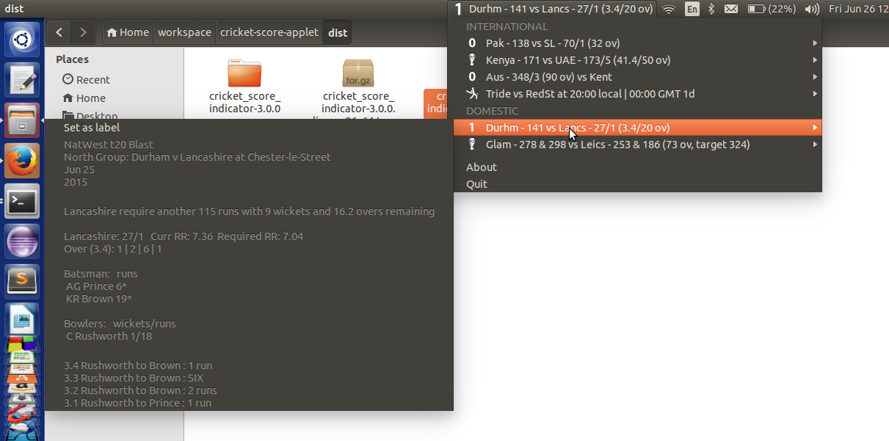

# Cricket Score Indicator
Displays live scores from ESPN website in your indicator panel

## Motivation
After being fed up with opening the ESPN Cricinfo website for checking the scores while working I along with my friend wrote the script for this appindicator.

## Working
Uses the unofficial JSON from [ESPN Website](http://www.espncricinfo.com/) to get the summary and scorecard for currently active matches.

## Screenshots
Shows the live scores in panel

Menu displays the current matches from the ESPN Cricinfo website.

The icon in the menu and indicator displays the run scored on the last delivery.
If match is finished (won) it will show a trophy icon.

Submenu shows scorecard 

If the match has not been started, then submenu will show the information regarding that match

